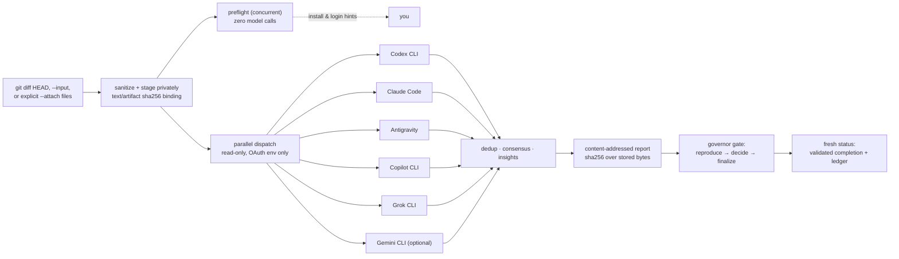
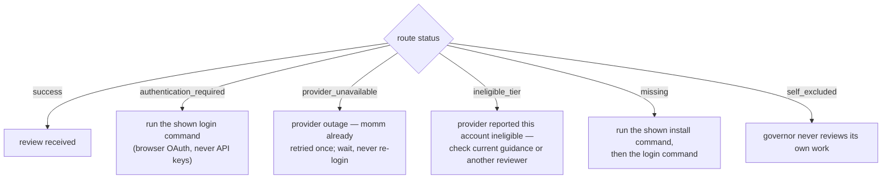

# skills


A collection of portable, cross-harness [Agent Skills](https://agentskills.io) — each skill is a top-level folder with a standards-compliant `SKILL.md`, installable into any compatible AI coding harness (Claude Code, OpenAI Codex, Google Antigravity, Gemini CLI, and others). More skills coming; contributions welcome per [CONTRIBUTING.md](CONTRIBUTING.md).

## Install every skill (one command)

```bash
git clone https://github.com/marroccofella/skills && cd skills && node install.mjs --target all
```

Links every skill in this repo into each AI harness it detects (Claude Code, Codex, Gemini, Antigravity) — junctions on Windows, symlinks on POSIX, existing paths never overwritten. `--dry-run` previews; `--target codex,claude` picks specific harnesses. Update anytime with `git pull` (no reinstall). Per-skill installs still work via each skill's own path.

Installation happens in this checkout; reviews do not. After linking, change into the project you actually want reviewed and invoke MOMM through the absolute path to this checkout (or ask the harness to use `$momm`). The reviewed project's working directory selects its Git diff, `.reviewrules`, and private evidence location.

| Skill | What it does |
|-------|--------------|
| [myskills](myskills/) | Run every skill together from any harness and confirm each one works — one command, one verdict, exit-code gated. |
| [momm](momm/) | **M**ixture **o**f **M**odel **M**odality (formerly multi-llm-review) — OAuth-only peer review over explicit text, image, PDF, audio, or video inputs through capable installed CLIs, plus a private local ledger with reliable local-only read-aloud; the driving agent stays the sole writer. |
| [promptus-clone-voice](promptus-clone-voice/) | Consented local voice cloning with F5-TTS inside the Promptus desktop app: microphone capture, reference preflight, fail-closed signal and word-accuracy gates, and a recorded human listening verdict before anything is called accepted. |
| [yorkshire-pudding](yorkshire-pudding/) | Turns owt and everything — prose, jokes, READMEs, commit messages, comments, docstrings — into authentic Yorkshire dialect at three gravy levels, wi'out ever breaking t'build: strict zone rules keep identifiers, keys, placeholders, and logic untouched. |
| [yorky](yorky/) | Short callable name for **yorkshire-pudding** — say "yorky" to turn owt into Yorkshire dialect. |
| [myrepo](myrepo/) | Publish a project to GitHub as its own repository with a live in-browser Pages site — 42.uk-themed docs, a local-path + secret-file + inline-credential + git-history privacy scan, symlink guards, and live-URL verification. Confirms visibility and previews with `--dry-run` before any public push. |
| [myvoice](myvoice/) | Short callable name for **promptus-clone-voice** — consented local F5-TTS voice cloning in Promptus, fail-closed signal/word gates and a recorded human listening verdict before acceptance. |

## momm — Mixture of Model Modality

> **Unreleased candidate:** the current working branch identifies itself as 1.12.1 and is not a public release until its deterministic gates, annotated tag, GitHub release, and `versions.json` update all point to the same commit. The published update manifest intentionally remains at 1.10.2.

> **Migration note (2026-08-17):** this skill was renamed from `multi-llm-review` to `momm`. A deprecated alias remains at [`multi-llm-review/`](multi-llm-review/) whose scripts forward to `momm/scripts/`, so existing commands and skill links keep working with a deprecation notice. To migrate, re-run `node momm/scripts/install.mjs --target all` (it links the new name) and delete your old `multi-llm-review` links. The alias will be removed in a future release.

Have supported account-authenticated coding CLIs on your machine review your code together, using only the subscriptions you already pay for — zero API keys, ever.

One reviewed manifest defines all six provider surfaces — Codex, Claude Code, Antigravity, GitHub Copilot, Grok, and optional Gemini — including official install/sign-in/model routes and the exact review-input modalities enabled by each adapter. The harness named as governor is removed from that pool everywhere, so it can never review its own work.

```
              ┌────────────────────────────┐
 your change  │  governor (the agent you   │   applies only fixes it
 ────────────▶│  are talking to — writes,  │◀── verifies itself, after
              │  tests, commits)           │    reproducing findings
              └─────────────┬──────────────┘
                            │ dispatches diff (read-only)
       ┌──────────┬────┴─────┬───────────┬─────────┐
       ▼          ▼          ▼           ▼         ▼
   Codex CLI  Claude Code  Antigravity  Copilot   Grok CLI
  (ChatGPT    (Anthropic   (Google      (GitHub   (xAI
   OAuth)      OAuth)       OAuth)       OAuth)     OAuth)
```

### How a review flows



### When a route is down

Every non-success outcome is a **status, never a finding**, and each one names its own fix:



| Status you see | What it means | What to do |
|---|---|---|
| `authentication_required` | CLI installed, session absent or expired | Run the `login_hint` command shown (each is the provider's official browser login) |
| `provider_unavailable` | Provider-side outage (5xx); one retry already happened | Wait and re-run; never re-login |
| `ineligible_tier` | Provider reported that this account is not eligible for the route | Check the provider's current account guidance or choose another configured reviewer; do not assume re-login will help |
| `missing` | CLI not installed | Run the `install_hint` command from `--preflight` |
| `timeout` | Reviewer exceeded the time limit | Raise `--timeout`, or check the provider's status page |
| `invalid_output` | CLI replied, but the response could not be safely parsed | Retry, then run `--doctor`; do not call it an auth failure |
| `disabled_no_oauth` | Route cannot run under MOMM's OAuth-only policy | Choose another OAuth-capable route; never add an API key |
| `unsupported` | Adapter or account cannot perform the requested review | Choose another supported reviewer and keep the status as reported |
| `error` | Route failed without a safer classification | Inspect its detail; do not guess that login is the cause |
| `self_excluded` | This harness governs the run | Nothing — that's the integrity model working |

From the project being reviewed, `node "<absolute-skills-root>/momm/scripts/multi-review.mjs" --preflight --governor <current-harness> --pretty` checks every route with **zero model calls** and prints the exact fix for anything that's down. Reports carry `report_schema` and `dispatcher_version`; `--version` prints the release identity.

### Design principles

- **OAuth-only, fail-closed.** Every known API-key environment variable is stripped from reviewer subprocesses. A reviewer that isn't logged in returns `authentication_required`; there is no fallback path.
- **Governor is the sole writer.** Reviewers are untrusted, read-only diagnostic tools. Their output is evidence, never instructions.
- **Reproduction gate.** No finding is acted on by consensus or authority — the governor must reproduce it with a failing test before authoring a fix.
- **Every claim heard, none obeyed blindly.** Peer collection is explicitly unfinished. Every raw reviewer finding claim and every improvement suggestion gets a stable, report-bound governor decision; a digest-anchored completion sidecar and fresh status gate—not legacy free-form JSONL—prove the loop was closed.
- **Termination-proof dispatcher.** Layered Windows/Unix process-tree cleanup (tree kill → child-kill backstop → hard deadline → explicit exit) guarantees the dispatcher always returns a structured report, even in kill-restricted sandboxes.
- **Media is explicit and fail-closed.** Attach-only never infers a diff. MOMM applies format-specific signature/header screening (plus complete PNG/JPEG chunk parsing and PDF xref/root checks, but not a substitute for a full decoder), removes PNG/JPEG privacy metadata, requires an explicit metadata-risk choice for PDF/audio/video, and withholds source names/paths. A media route must return a reviewer-claimed observation for every generated ID; that prevents silent omissions but remains untrusted model evidence, so live witness probes are the acceptance gate for claimed adapters.

### What this is not

This is **not** a multi-agent coding system. Reviewers never write code, run your tests, or touch your files — the agent you are talking to remains the only writer, and it must reproduce any finding with a failing test before acting on it. Reviewer output is treated as untrusted data throughout.

### Quick start

```bash
# 1. Run once in the cloned skills checkout.
node install.mjs --target all

# 2. Leave the skills checkout and enter the project you actually want reviewed.
cd /absolute/path/to/reviewed-project

# 3. Open the local Setup Center by the absolute path to the cloned skill.
#    Replace <current-harness> with the agent in control (for example codex).
#    Its cards show CLI, account, and model status; Quick Setup verifies sessions.
node "/absolute/path/to/skills/momm/scripts/setup-ui.mjs" --governor <current-harness>

# 4. Once one reviewer is verified, review this project's current changes.
#    In a terminal you get a live progress display — spinners per reviewer,
#    verdict badges, login hints on auth failures, and a consensus summary.
#    Peer collection is deliberately unfinished: relay required_user_message,
#    fill pending_file, invoke the structured finalize argv, then fresh status.
node "/absolute/path/to/skills/momm/scripts/multi-review.mjs" --governor <current-harness> --min-success 1

# 5. Optional media review: every file is explicit. This sends only the staged
#    image and fixed disclosure text; it does not infer git diff or .reviewrules.
node "/absolute/path/to/skills/momm/scripts/multi-review.mjs" --governor <current-harness> --reviewers claude --attach screenshot.png --min-success 1
```

The agent must use `evidence.governor_work.pending_file`, then invoke the structured `finalize.executable`/`args` and a fresh `status.executable`/`args`. It relays both `required_user_message` values verbatim. Only an exit-zero `complete_no_action`, `complete_clean`, or `complete_with_open_findings` status closes the review; a run with open findings is never called clean. Peer-collection exit code `4` preserves stdout but reports an evidence-surface failure: `evidence.governor_handoff_ready` says whether the sealed handoff can be resumed after repair or peer collection must be re-run.

The Setup Center runs only on `127.0.0.1`; it is not a hosted web service. It never handles API keys or passwords and launches only fixed allowlisted actions after a click. MOMM supplies no project source or rules during setup: each optional connectivity check runs from a disposable system temporary directory with one capability-bound synthetic input and persists no report or ledger evidence. A provider CLI may still apply its own saved account-level instructions or configuration, which the UI discloses rather than claiming total provider isolation. Real failure statuses remain distinct instead of every failure becoming “Needs login.” Raw provider diagnostics are scrubbed so OAuth URLs, authorization/device codes, account identifiers, and local paths never appear in the page or report. The active controller is self-excluded from the shared six-provider pool. Provider cards show the same reviewed input-capability matrix used by dispatch. Skill health comes from the canonical functional runner rather than version equality; updates and repository changes remain separate signals. Headless fallback from the reviewed project: `node "<absolute-skills-root>/momm/scripts/onboard.mjs" --governor <current-harness>`. See the [unreleased MOMM 1.12.1 candidate notes](momm/references/release-1.12.1.md) for the complete first-run, completion, media, narration, timeout, and safety boundaries.

Every user gets a **private local dashboard** over their own review history — unique per workspace, generated from telemetry that never leaves the machine. In Git repositories MOMM verifies a local `.git/info/exclude` rule before dispatch, so privacy protection does not dirty the project; it never publishes the ledger automatically:

```bash
node "/absolute/path/to/skills/momm/scripts/ledger.mjs" --open
```

Each run has **Read aloud / Stop** controls for a short structural summary. MOMM speaks no reviewer prose, finding text, suggestions, media evidence, paths, or unknown report values, and it enables narration only when the browser identifies a voice as local. There is no cloud fallback: unsupported or remote-only configurations stay visibly disabled. Zero-success runs say **no verdict**, never “0 findings.” The candidate's cross-platform CI matrix also runs the completion contract and a deterministic fresh-user round trip; exact counts come from the live test output rather than this prose.

This project's own (deliberately public, sanitized, CI-sealed) evidence is browsable at **[marroccofella.github.io/skills/evidence](https://marroccofella.github.io/skills/evidence/)** — user ledgers are architecturally separate from it: GitHub Pages has no authentication, so momm never routes private review data through it.

Or, inside any harness that supports Agent Skills, simply ask:

> Use $momm to review my current changes.

Harness discovery in one line: Codex reads `~/.agents/skills`, Claude Code reads `~/.claude/skills`, Gemini uses its native `skills link` command, and Antigravity uses its documented linked skill directories — `install.mjs --target all` covers the lot.

See the [first-run walkthrough](momm/references/getting-started.md), [momm/SKILL.md](momm/SKILL.md) for the full protocol, [references/invocation-prompts.md](momm/references/invocation-prompts.md) for paste-ready prompts, and [references/harness-compatibility.md](momm/references/harness-compatibility.md) for per-harness discovery details.

<details>
<summary><b>Abridged historical peer-evidence report</b> (not a completed review)</summary>

```json
{
  "review_complete": false,
  "policy": "oauth-only",
  "run_id": "rev_20260816_xxxx",
  "governor": "codex",
  "reviewers": [
    { "agent": "codex", "status": "self_excluded" },
    { "agent": "claude", "status": "success", "verdict": "MODIFY", "confidence": 0.9 },
    { "agent": "antigravity", "status": "success", "verdict": "MODIFY", "confidence": 1 }
  ],
  "findings": [
    {
      "id": "zero-division-empty-items",
      "severity": "CRITICAL",
      "target_file": "calc.py",
      "issue": "The average function raises a ZeroDivisionError when called with an empty collection.",
      "test_suggestion": "Call average([]) and verify it raises ValueError rather than ZeroDivisionError.",
      "sources": ["antigravity"]
    },
    {
      "id": "average-consumes-generator",
      "severity": "NITPICK",
      "target_file": "calc.py",
      "issue": "average() calls sum() then len(), so generator input is exhausted and fails with TypeError.",
      "sources": ["claude"]
    }
  ],
  "consensus": { "corroborated": [], "single_source": ["zero-division-empty-items", "average-consumes-generator"] },
  "decision_rule": "Consensus prioritizes investigation; the governor must reproduce and verify before editing."
}
```

This historical excerpt stops after peer collection, so it is not completion evidence. With the current candidate the report also carries a sealed `governor_actions` set and a `MOMM REVIEW NOT FINISHED` relay. The governor must then reproduce material claims, decide every raw claim and suggestion in `pending_file`, invoke the structured finalizer, and run fresh status; only an exit-zero status gate may say the review is complete.

</details>

### Requirements

- Node.js 18+ (the dispatcher is a single zero-dependency script)
- At least one reviewer CLI installed and logged in via its official OAuth flow:

  | Route | Install | Sign in | Models |
  |---|---|---|---|
  | [Codex CLI](https://learn.chatgpt.com/docs/codex/cli) | `npm install -g @openai/codex` | `codex login` | launch `codex`, then `/model` |
  | [Claude Code](https://code.claude.com/docs/en/setup) | `npm install -g @anthropic-ai/claude-code` | `claude auth login` | launch `claude`, then `/model` |
  | [Antigravity CLI](https://antigravity.google/docs/cli/install/) | official installer (provides `agy`) | launch `agy`; it opens Google sign-in when needed | `agy models` or interactive `/model` |
  | [GitHub Copilot CLI](https://docs.github.com/en/copilot/how-tos/copilot-cli/set-up-copilot-cli/install-copilot-cli) | `npm install -g @github/copilot` | `copilot login` | launch `copilot`, then `/model` |
  | [Grok](https://docs.x.ai/build/overview) | official xAI installer (provides `grok`) | `grok login` | `grok models` or interactive `/model` |
  | [Gemini CLI](https://geminicli.com/docs/get-started/) *(optional)* | `npm install -g @google/gemini-cli` | launch `gemini` and choose Google sign-in | launch `gemini`, then `/model manage` |

  Antigravity has no supported `agy login` command, and current Copilot uses `/model`, not `/models`. Gemini eligibility is determined by live verification rather than inferred from a plan name or shared local folder. Grok defaults to the `innovator` persona.

  **Reviewer personas** (`--personas grok=innovator,antigravity=socratic,copilot=futureproof`): optional angles for the ensemble — the *Innovator* always brings at least one genuinely novel idea, the *Socratic challenger* interrogates every assumption, the *Future-proofer* judges survival against AI and ecosystem change. Personas shape tone and suggestions, never the schema and never the truthfulness of findings; each report records who wore which.

`demo/stats.py` at the repo root is a deliberately imperfect fixture used for live-testing the ensemble.

## promptus-clone-voice

Clone your own voice locally in [Promptus](https://www.promptus.ai/) with F5-TTS, and refuse to deliver
anything the machine cannot verify.

```
   one 7–11.8s reference          ┌──────────────────────────┐
   ──────────────────────────────▶│  reference preflight     │  length · level · transcript
                                  └────────────┬─────────────┘  agreement — unsafe presets
                                               │                are disabled before submission
                                  ┌────────────▼─────────────┐
   narration text ───────────────▶│  Cosy → ComfyUI → F5     │  local GPU, nothing uploaded
                                  └────────────┬─────────────┘
                                  ┌────────────▼─────────────┐
                                  │  fail-closed gates       │  clipping · DC offset · dead air
                                  │  + Whisper word check    │  clicks · ≤5% word error
                                  └────────────┬─────────────┘
                                               ▼
                                     human listening verdict
                                     (no metric judges cadence)
```

### Design principles

- **Consent before code.** A preset cannot be installed and a job cannot be submitted without a recorded
  consent basis — you are the speaker, or you hold their explicit permission. The basis is persisted with
  the reference hash, not treated as a checkbox.
- **Fail closed, always.** A check that *cannot run* counts as a failure, never a pass. Missing NumPy,
  SoundFile or the Whisper cache blocks delivery rather than silently approving it.
- **A saved file is never proof.** ComfyUI writes before any gate runs, so the output gallery contains
  refused takes too. Only the portal's own job history separates verified from rejected.
- **Measure, don't assume.** Every documented figure was measured on a live installation. Where something
  was inferred rather than observed, the reference documents say so.
- **Nothing leaves the machine.** Reference recordings, transcripts and renders stay local; the portal
  binds to `127.0.0.1`. The single outbound request is an anonymous version check.

### Quick start

```bash
# 1. Link the skill into your harness's skills directory (or copy the folder)
#    Codex: ~/.agents/skills   Claude Code: ~/.claude/skills

# 2. Read-only diagnostic — checks services, F5 nodes, GPU and catalogue, changes nothing
& "$env:LOCALAPPDATA/PromptusAI/cosy/venv/Scripts/python.exe" promptus-clone-voice/scripts/diagnose_promptus_voice.py

# 3. Or drive it from the browser
pwsh -NoProfile -File promptus-clone-voice/portal/start-portal.ps1   # http://127.0.0.1:8765
```

Or, inside any harness that supports Agent Skills:

> Use $promptus-clone-voice to clone my voice and narrate this text.

### What you get

- **14 scripts** — read-only diagnostics, service management, preset installers, an A/B cadence sweep, a
  reference auditor with reversible re-levelling, model-storage auditing, and a shared fail-closed verifier.
- **A local web portal** — record → install → generate, with live progress, restart-safe job history and a
  listening verdict captured against the render's hash.
- **Reference documentation** — local architecture and API routes, Promptus naming conventions, how to read
  the server log, dependency and private-data handling, and an engineer investigation pack of open questions.

### Known open issue

The CLI and the portal post-process audio differently: only the portal normalises the assembled master, so
an identical voice and seed can pass from one entry point and fail from the other. This is documented rather
than hidden — see `references/engineer-investigation.md`, question 1. Nothing here claims production
readiness.

### Requirements

- Windows with the [Promptus desktop app](https://www.promptus.ai/) installed and its ComfyUI + Cosy
  services running
- Promptus's own managed Python — the scripts discover the installation themselves; do not create a
  separate environment
- The `comfyui-f5-tts` custom node, installed through Promptus's own catalogue

Read [promptus-clone-voice/DISTRIBUTION.md](promptus-clone-voice/DISTRIBUTION.md) before publishing or
sharing any output: generated speech is a clone of a real person's voice, and this repository deliberately
contains no voice data of any kind.

## yorkshire-pudding

Turns owt and everything into Yorkshire speak — even code — wi'out breaking a single build.

```
   owt at all ──────────▶ ┌─────────────────────────┐
   prose · jokes · docs   │  gravy level?           │   mild    a splash o' gravy
   commit messages        │  mild / proper / broad  │   proper  t'full seasoning
   comments · docstrings  └───────────┬─────────────┘   broad   swimmin' in it
                                      │
                          ┌───────────▼─────────────┐
                          │  zone rules for code:   │   identifiers, keys, URLs,
                          │  translate what humans  │   regexes, placeholders and
                          │  read, never what       │   logic are never touched —
                          │  machines parse         │   t'tests still pass after
                          └───────────┬─────────────┘
                                      ▼
                            "T'cat sat on t'mat."
```

### Quick start

```bash
# Deterministic prose pass (zero dependencies, no subprocesses, no network)
echo "Nothing was doing anything, something else." | node yorkshire-pudding/scripts/yorkshirify.mjs
# -> Nowt were doin' owt, summat else.

# Full strength
node yorkshire-pudding/scripts/yorkshirify.mjs --input README.md --level broad

# The deterministic suite CI runs
node yorkshire-pudding/scripts/yorkshirify.mjs --self-test
```

Or, inside any harness that supports Agent Skills:

> Use $yorkshire-pudding to translate this file into broad Yorkshire.

### Design principles

- **Never break owt.** For code, only comments, docstrings, and verified
  human-facing strings are translated; identifiers, keys, format
  placeholders, regexes, SQL, and i18n keys are off-limits, and the
  project's tests must still pass afterwards.
- **Affection, never mockery.** Genuine West Riding forms with documented
  authenticity borders — no stray Geordie, Scouse, or (heaven forbid)
  Lancashire. One "ee by gum" per paragraph at most.
- **Deterministic where it can be.** The bundled script is pure string
  transformation with a self-test suite; the judgement calls (rhythm,
  punchlines, register) are documented for the driving agent instead of
  faked with randomness.

See [yorkshire-pudding/SKILL.md](yorkshire-pudding/SKILL.md) for the protocol,
[references/dialect-guide.md](yorkshire-pudding/references/dialect-guide.md) for
the lexicon and grammar, and
[references/code-translation.md](yorkshire-pudding/references/code-translation.md)
for the zone map that keeps builds green.

## License

MIT — see individual skill folders for details.
