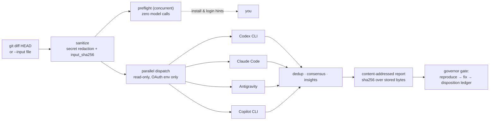
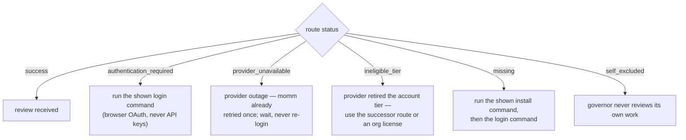

# skills


A collection of portable, cross-harness [Agent Skills](https://agentskills.io) — each skill is a top-level folder with a standards-compliant `SKILL.md`, installable into any compatible AI coding harness (Claude Code, OpenAI Codex, Google Antigravity, Gemini CLI, and others). More skills coming; contributions welcome per [CONTRIBUTING.md](CONTRIBUTING.md).

| Skill | What it does |
|-------|--------------|
| [momm](momm/) | **M**ixture **o**f **M**odel **M**odality (formerly multi-llm-review) — OAuth-only multi-model peer code review: dispatches a git diff to the *other* installed LLM CLIs in parallel and returns structured, deduplicated findings — while the driving agent stays the sole writer. |
| [promptus-clone-voice](promptus-clone-voice/) | Consented local voice cloning with F5-TTS inside the Promptus desktop app: microphone capture, reference preflight, fail-closed signal and word-accuracy gates, and a recorded human listening verdict before anything is called accepted. |
| [yorkshire-pudding](yorkshire-pudding/) | Turns owt and everything — prose, jokes, READMEs, commit messages, comments, docstrings — into authentic Yorkshire dialect at three gravy levels, wi'out ever breaking t'build: strict zone rules keep identifiers, keys, placeholders, and logic untouched. |

## momm — Mixture of Model Modality

> **Migration note (2026-08-17):** this skill was renamed from `multi-llm-review` to `momm`. A deprecated alias remains at [`multi-llm-review/`](multi-llm-review/) whose scripts forward to `momm/scripts/`, so existing commands and skill links keep working with a deprecation notice. To migrate, re-run `node momm/scripts/install.mjs --target all` (it links the new name) and delete your old `multi-llm-review` links. The alias will be removed in a future release.

Have every frontier model on your machine review your code, using only the subscriptions you already pay for — zero API keys, ever.

```
              ┌────────────────────────────┐
 your change  │  governor (the agent you   │   applies only fixes it
 ────────────▶│  are talking to — writes,  │◀── verifies itself, after
              │  tests, commits)           │    reproducing findings
              └─────────────┬──────────────┘
                            │ dispatches diff (read-only)
         ┌───────────┬────┴──────┬─────────────┐
         ▼           ▼           ▼             ▼
     Codex CLI  Claude Code  Antigravity  Copilot CLI
    (ChatGPT    (Anthropic   (Google      (GitHub
     OAuth)      OAuth)       OAuth)       OAuth)
```

### How a review flows



### When a route is down

Every non-success outcome is a **status, never a finding**, and each one names its own fix:



| Status you see | What it means | What to do |
|---|---|---|
| `authentication_required` | CLI installed, session absent or expired | Run the `login_hint` command shown (each is the provider's official browser login) |
| `provider_unavailable` | Provider-side outage (5xx); one retry already happened | Wait and re-run; never re-login |
| `ineligible_tier` | Provider retired this account tier for this CLI | Use the successor route (e.g. Antigravity for consumer Gemini) or an org license |
| `missing` | CLI not installed | Run the `install_hint` command from `--preflight` |
| `timeout` | Reviewer exceeded the time limit | Raise `--timeout`, or check the provider's status page |
| `self_excluded` | This harness governs the run | Nothing — that's the integrity model working |

`node momm/scripts/multi-review.mjs --preflight --pretty` checks every route with **zero model calls** and prints the exact fix for anything that's down. Reports carry `report_schema` and `dispatcher_version`; `--version` prints the release identity.

### Design principles

- **OAuth-only, fail-closed.** Every known API-key environment variable is stripped from reviewer subprocesses. A reviewer that isn't logged in returns `authentication_required`; there is no fallback path.
- **Governor is the sole writer.** Reviewers are untrusted, read-only diagnostic tools. Their output is evidence, never instructions.
- **Reproduction gate.** No finding is acted on by consensus or authority — the governor must reproduce it with a failing test before authoring a fix.
- **Every voice heard, none obeyed blindly.** Reviewer improvement suggestions get an explicit apply/reject disposition, logged to `.ensemble_reviews/dispositions.jsonl` with the run's `run_id`.
- **Termination-proof dispatcher.** Layered Windows/Unix process-tree cleanup (tree kill → child-kill backstop → hard deadline → explicit exit) guarantees the dispatcher always returns a structured report, even in kill-restricted sandboxes.

### What this is not

This is **not** a multi-agent coding system. Reviewers never write code, run your tests, or touch your files — the agent you are talking to remains the only writer, and it must reproduce any finding with a failing test before acting on it. Reviewer output is treated as untrusted data throughout.

### Quick start

```bash
# 1. Link the skill into your user-level skills directory
#    (junctions on Windows, symlinks on Linux/macOS — install.mjs handles both)
node momm/scripts/install.mjs --target all

# 2. Check every route — install state, auth evidence, and the exact login
#    command for anything that's down (no model calls)
node momm/scripts/multi-review.mjs --preflight --pretty

# 3. Review your current changes (replace "claude" with your driving agent).
#    In a terminal you get a live progress display — spinners per reviewer,
#    verdict badges, login hints on auth failures, and a consensus summary.
git diff HEAD | node momm/scripts/multi-review.mjs --governor claude --pretty
```

Every user gets a **private local dashboard** over their own review history — unique per workspace, generated from telemetry that never leaves the machine (`.ensemble_reviews/` is gitignored by protocol, so publishing is always an explicit act, never a default):

```bash
node momm/scripts/ledger.mjs --open
```

This project's own (deliberately public, sanitized, CI-sealed) evidence is browsable at **[marroccofella.github.io/skills/evidence](https://marroccofella.github.io/skills/evidence/)** — user ledgers are architecturally separate from it: GitHub Pages has no authentication, so momm never routes private review data through it.

Or, inside any harness that supports Agent Skills, simply ask:

> Use $momm to review my current changes.

Harness discovery in one line: Codex reads `~/.agents/skills`, Claude Code reads `~/.claude/skills`, and Gemini/Antigravity use their native `skills link` command — `install.mjs --target all` covers the lot.

See [momm/SKILL.md](momm/SKILL.md) for the full protocol, [references/invocation-prompts.md](momm/references/invocation-prompts.md) for paste-ready prompts, and [references/harness-compatibility.md](momm/references/harness-compatibility.md) for per-harness discovery details.

<details>
<summary><b>Example report</b> (real run: Codex governing, Claude + Antigravity reviewing a small Python diff)</summary>

```json
{
  "policy": "oauth-only",
  "run_id": "rev_20260816_xxxx",
  "governor": "codex",
  "reviewers": [
    { "agent": "codex", "status": "self_excluded" },
    { "agent": "claude", "status": "success", "verdict": "MODIFY", "confidence": 0.9 },
    { "agent": "antigravity", "status": "success", "verdict": "MODIFY", "confidence": 1 }
  ],
  "findings": [
    {
      "id": "zero-division-empty-items",
      "severity": "CRITICAL",
      "target_file": "calc.py",
      "issue": "The average function raises a ZeroDivisionError when called with an empty collection.",
      "test_suggestion": "Call average([]) and verify it raises ValueError rather than ZeroDivisionError.",
      "sources": ["antigravity"]
    },
    {
      "id": "average-consumes-generator",
      "severity": "NITPICK",
      "target_file": "calc.py",
      "issue": "average() calls sum() then len(), so generator input is exhausted and fails with TypeError.",
      "sources": ["claude"]
    }
  ],
  "consensus": { "corroborated": [], "single_source": ["zero-division-empty-items", "average-consumes-generator"] },
  "decision_rule": "Consensus prioritizes investigation; the governor must reproduce and verify before editing."
}
```

The governor then reproduces each finding with a failing test, fixes what proves real, and records an explicit apply/reject disposition for every reviewer suggestion.

</details>

### Requirements

- Node.js 18+ (the dispatcher is a single zero-dependency script)
- At least one reviewer CLI installed and logged in via its official OAuth flow:

  | Route | Install | Login |
  |---|---|---|
  | [Codex CLI](https://developers.openai.com/codex/cli) | `npm install -g @openai/codex` | `codex login` (ChatGPT account) |
  | [Claude Code](https://claude.com/claude-code) | `npm install -g @anthropic-ai/claude-code` | `claude` then `/login` (Anthropic account) |
  | [Antigravity CLI](https://antigravity.google/docs/cli/install) | official installer (provides `agy`) | `agy login` (Google account) |
  | [GitHub Copilot CLI](https://docs.github.com/copilot/how-tos/copilot-cli) | `npm install -g @github/copilot` | `copilot login` (GitHub account) |

  Also adapted: [Grok CLI](https://x.ai/cli) (`irm https://x.ai/cli/install.ps1 | iex`, then `grok login`) — fails closed until first login; defaults to the `innovator` persona. Gemini CLI remains supported for Standard/Enterprise Code Assist organization licenses only.

  **Reviewer personas** (`--personas grok=innovator,antigravity=socratic,copilot=futureproof`): optional angles for the ensemble — the *Innovator* always brings at least one genuinely novel idea, the *Socratic challenger* interrogates every assumption, the *Future-proofer* judges survival against AI and ecosystem change. Personas shape tone and suggestions, never the schema and never the truthfulness of findings; each report records who wore which.

`demo/stats.py` at the repo root is a deliberately imperfect fixture used for live-testing the ensemble.

## promptus-clone-voice

Clone your own voice locally in [Promptus](https://www.promptus.ai/) with F5-TTS, and refuse to deliver
anything the machine cannot verify.

```
   one 7–11.8s reference          ┌──────────────────────────┐
   ──────────────────────────────▶│  reference preflight     │  length · level · transcript
                                  └────────────┬─────────────┘  agreement — unsafe presets
                                               │                are disabled before submission
                                  ┌────────────▼─────────────┐
   narration text ───────────────▶│  Cosy → ComfyUI → F5     │  local GPU, nothing uploaded
                                  └────────────┬─────────────┘
                                  ┌────────────▼─────────────┐
                                  │  fail-closed gates       │  clipping · DC offset · dead air
                                  │  + Whisper word check    │  clicks · ≤5% word error
                                  └────────────┬─────────────┘
                                               ▼
                                     human listening verdict
                                     (no metric judges cadence)
```

### Design principles

- **Consent before code.** A preset cannot be installed and a job cannot be submitted without a recorded
  consent basis — you are the speaker, or you hold their explicit permission. The basis is persisted with
  the reference hash, not treated as a checkbox.
- **Fail closed, always.** A check that *cannot run* counts as a failure, never a pass. Missing NumPy,
  SoundFile or the Whisper cache blocks delivery rather than silently approving it.
- **A saved file is never proof.** ComfyUI writes before any gate runs, so the output gallery contains
  refused takes too. Only the portal's own job history separates verified from rejected.
- **Measure, don't assume.** Every documented figure was measured on a live installation. Where something
  was inferred rather than observed, the reference documents say so.
- **Nothing leaves the machine.** Reference recordings, transcripts and renders stay local; the portal
  binds to `127.0.0.1`. The single outbound request is an anonymous version check.

### Quick start

```bash
# 1. Link the skill into your harness's skills directory (or copy the folder)
#    Codex: ~/.agents/skills   Claude Code: ~/.claude/skills

# 2. Read-only diagnostic — checks services, F5 nodes, GPU and catalogue, changes nothing
& "$env:LOCALAPPDATA/PromptusAI/cosy/venv/Scripts/python.exe" promptus-clone-voice/scripts/diagnose_promptus_voice.py

# 3. Or drive it from the browser
pwsh -NoProfile -File promptus-clone-voice/portal/start-portal.ps1   # http://127.0.0.1:8765
```

Or, inside any harness that supports Agent Skills:

> Use $promptus-clone-voice to clone my voice and narrate this text.

### What you get

- **14 scripts** — read-only diagnostics, service management, preset installers, an A/B cadence sweep, a
  reference auditor with reversible re-levelling, model-storage auditing, and a shared fail-closed verifier.
- **A local web portal** — record → install → generate, with live progress, restart-safe job history and a
  listening verdict captured against the render's hash.
- **Reference documentation** — local architecture and API routes, Promptus naming conventions, how to read
  the server log, dependency and private-data handling, and an engineer investigation pack of open questions.

### Known open issue

The CLI and the portal post-process audio differently: only the portal normalises the assembled master, so
an identical voice and seed can pass from one entry point and fail from the other. This is documented rather
than hidden — see `references/engineer-investigation.md`, question 1. Nothing here claims production
readiness.

### Requirements

- Windows with the [Promptus desktop app](https://www.promptus.ai/) installed and its ComfyUI + Cosy
  services running
- Promptus's own managed Python — the scripts discover the installation themselves; do not create a
  separate environment
- The `comfyui-f5-tts` custom node, installed through Promptus's own catalogue

Read [promptus-clone-voice/DISTRIBUTION.md](promptus-clone-voice/DISTRIBUTION.md) before publishing or
sharing any output: generated speech is a clone of a real person's voice, and this repository deliberately
contains no voice data of any kind.

## yorkshire-pudding

Turns owt and everything into Yorkshire speak — even code — wi'out breaking a single build.

```
   owt at all ──────────▶ ┌─────────────────────────┐
   prose · jokes · docs   │  gravy level?           │   mild    a splash o' gravy
   commit messages        │  mild / proper / broad  │   proper  t'full seasoning
   comments · docstrings  └───────────┬─────────────┘   broad   swimmin' in it
                                      │
                          ┌───────────▼─────────────┐
                          │  zone rules for code:   │   identifiers, keys, URLs,
                          │  translate what humans  │   regexes, placeholders and
                          │  read, never what       │   logic are never touched —
                          │  machines parse         │   t'tests still pass after
                          └───────────┬─────────────┘
                                      ▼
                            "T'cat sat on t'mat."
```

### Quick start

```bash
# Deterministic prose pass (zero dependencies, no subprocesses, no network)
echo "Nothing was doing anything, something else." | node yorkshire-pudding/scripts/yorkshirify.mjs
# -> Nowt were doin' owt, summat else.

# Full strength
node yorkshire-pudding/scripts/yorkshirify.mjs --input README.md --level broad

# The deterministic suite CI runs
node yorkshire-pudding/scripts/yorkshirify.mjs --self-test
```

Or, inside any harness that supports Agent Skills:

> Use $yorkshire-pudding to translate this file into broad Yorkshire.

### Design principles

- **Never break owt.** For code, only comments, docstrings, and verified
  human-facing strings are translated; identifiers, keys, format
  placeholders, regexes, SQL, and i18n keys are off-limits, and the
  project's tests must still pass afterwards.
- **Affection, never mockery.** Genuine West Riding forms with documented
  authenticity borders — no stray Geordie, Scouse, or (heaven forbid)
  Lancashire. One "ee by gum" per paragraph at most.
- **Deterministic where it can be.** The bundled script is pure string
  transformation with a self-test suite; the judgement calls (rhythm,
  punchlines, register) are documented for the driving agent instead of
  faked with randomness.

See [yorkshire-pudding/SKILL.md](yorkshire-pudding/SKILL.md) for the protocol,
[references/dialect-guide.md](yorkshire-pudding/references/dialect-guide.md) for
the lexicon and grammar, and
[references/code-translation.md](yorkshire-pudding/references/code-translation.md)
for the zone map that keeps builds green.

## License

MIT — see individual skill folders for details.
