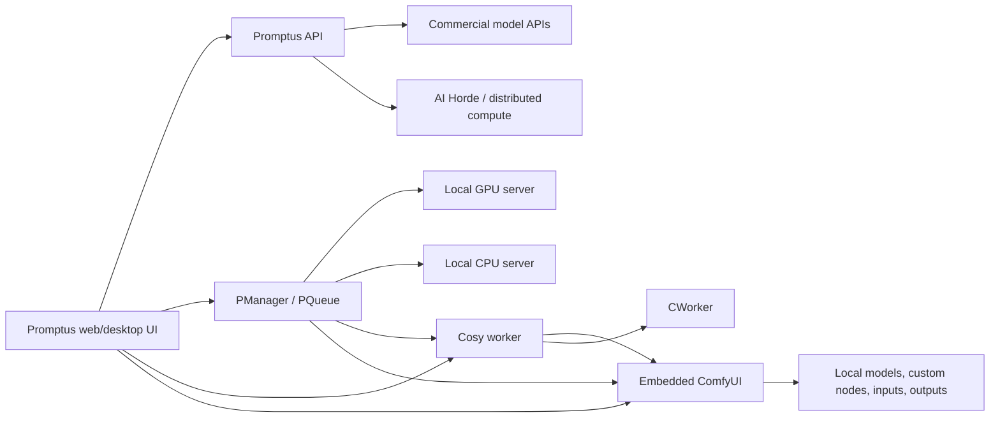

# Technology Architecture

This document separates directly observed installation facts from architectural inference.

## High-level system

## Desktop shell

**Installed observations**

- `promptusai.exe` product version: **1.0.112.0**; file version **1.0.112**.
- Live PWA navigation displayed **v1.0.99.115**.
- Installation record reported launcher/Delphi schema version **1.2.3**.
- The installation contains Electron/Chromium artefacts: `resources/app.asar`, Electron licence files, Chromium locale/resource packs, V8 snapshots, and WebView/EGL/GLES libraries.
- Native Node modules unpacked beside the application include `sharp`, `sqlite3`, `ffmpeg-static`, ExifTool packages, and Datadog native application-security packages.

**Inference**

The desktop is an Electron-family packaged web application. The exact internal source layout was not unpacked for this audit, but the `.asar` package and Chromium runtime artefacts make the shell classification high confidence.

## Web client

**Live UI observations**

- Single-page application with hash routes (`#/`, `#/cosyflows`, `#/servers`, and so on).
- Hashed JavaScript/CSS chunks and a root-mounted client UI.
- Utility-class names and compiled rules identify Tailwind CSS.
- React-style Create React App chunk naming and root mounting are strongly suggestive, but the production source/package manifest was not inspected; treat “React” as high-confidence inference, not a vendor statement.
- Login and app shell currently redirect from `https://app.promptus.ai/` to `https://login.promptus.ai/pwa_demo/index.html`.

## Embedded Python and local services

The installation includes an embedded **Python 3.12** distribution and separate managed environments for Promptus/Cosy/ComfyUI.

### Cosy worker

The observed worker is a Flask service with Requests, Pillow, WebSocket client, Flask-CORS, and watchdog dependencies. It:

- discovers bundled and user-local `.cosy` files;
- reports workflow variables, models, LoRAs, progress, and install state;
- installs/uninstalls local CosyFlows;
- installs workflow dependencies;
- submits generation jobs to ComfyUI;
- can create/share workflows;
- watches local CosyFlow directories for changes.

Observed development build behavior in the local voice research identifies worker version **0.110** and notes that many successful routes return HTTP 201. Confirm this after upgrades.

Default observed endpoints:

| Service | Default address | Role |
|---|---|---|
| PManager | `http://127.0.0.1:7412` | Local service lifecycle/status. |
| Cosy | `http://127.0.0.1:8190` | Workflow catalogue, variables, installation, and generation orchestration. |
| ComfyUI | `http://127.0.0.1:8288` | Node graph execution, queue, history, system stats, and outputs. |

### ComfyUI

Promptus ships a managed ComfyUI tree with models, custom nodes, input/output directories, and its own environment. CosyFlow metadata declares the custom nodes and external models needed by a workflow. PManager owns startup/restart so Promptus can keep those components aligned.

### Local GPU and CPU servers

The live Server screen exposes independent GPU and CPU servers for local inference. Their exact model contracts are installation/configuration dependent.

### CWorker

CWorker requires ComfyUI in the live UI. Local voice tooling uses it as part of the app-managed generation path. Treat it as an execution/orchestration component rather than a user-facing model.

### PManager and PQueue

Installed executable metadata:

- `pmanager.exe` file version **1.0.0.166**.
- `pqueue.exe` file version **1.0.0.166**.

PManager installs/controls services. PQueue is the companion queue application. Service commands or process lines may contain credentials; documentation should describe behavior without copying raw process arguments.

## Storage and discovery

On the audited Windows installation:

| Purpose | Location pattern |
|---|---|
| Installation discovery | `%APPDATA%\promptusai\install.json` |
| Install root | Value of `installRoot` in the discovery record |
| Bundled CosyFlows | `<installRoot>\cosy\promptus\cosyflow` |
| Bundled API flows | `<installRoot>\cosy\promptus\api` |
| Local user CosyFlows | Read `COSY.COSYFLOW_LOCAL_DIR` from the active backend config; observed as `<installRoot>\models\comfy_models\cosyflow` |
| ComfyUI root | `<installRoot>\cosy\comfyui\ComfyUI` |
| ComfyUI input/output | `<ComfyUI>\input` and `<ComfyUI>\output` |
| Backend config | `<installRoot>\models\<backend>_models\cosy.json` |
| Desktop metadata/output index | SQLite databases at the install root |

Never assume `models\cosyflow`; it is only a fallback in the Cosy configuration. Read the backend's `COSY` section and do not print unrelated sections because they can contain provider credentials.

## Media pipeline technologies

Observed components include:

- FFmpeg (desktop static binary and Comfy-related media processing).
- Sharp/libvips for desktop image processing.
- ExifTool for metadata inspection/writing.
- SQLite for local application/output indexes.
- Pillow and ComfyUI image processing in Python.
- WebSocket communication with generation backends.
- CUDA/PyTorch in managed ComfyUI/model environments.

## Provider and bridge surface

Installed bridge modules or bundled API workflows were observed for the following families. Presence on disk means “supported by this build's catalogue/bridge layer”, not “enabled for this account”.

- AI Horde.
- AIML API and AI music/Udio-style bridges.
- Black Forest Labs/Flux.
- ByteDance/BytePlus (Seedream and video workflows).
- Google GenAI/Gemini image and video.
- OpenAI chat, image, and video workflows.
- Luma.
- Stability AI.
- Runway, Kling, Pika, PixVerse, Vidu, Veo, Hailuo/Minimax, Moonvalley, Magnific, Topaz, Recraft, Ideogram, Tripo, Rodin, and Hunyuan 3D families.

Provider availability, names, and billing change rapidly; query the live catalogue rather than coding a static allow-list.

## Local model/workflow families observed

The bundled local catalogue includes image, video, audio, 3D, LLM, and utility graphs across families such as Flux, SDXL/SD3.5, Qwen Image, Z-Image, HiDream, Hunyuan, Wan, LTX, Kandinsky, Cosmos, ACE-Step, Stable Audio, F5-TTS, Kokoro, Zonos, Gemma, Qwen, MoGe, TripoSplat, background removal, interpolation, and upscaling.

## Trust and privacy boundaries

- A local ComfyUI workflow can be fully offline once dependencies/models exist.
- Any workflow using online nodes, account APIs, cloud models, or model downloads crosses a network boundary.
- The Settings screen has an explicit “Use non-trusted cosyflow” control. New apps should preserve a visible distinction between verified/bundled workflows and untrusted/imported workflows.
- Do not display API keys, account identifiers, raw launcher commands, or entire backend config files.
- Local voice references and other sensitive inputs should stay on-device unless the user explicitly selects a cloud route.

## Known operational caveats from the audited voice workflow

- Cosy worker 0.110 can report its busy state incorrectly after a completed job; the ComfyUI queue plus a local job lock are the authoritative admission signals in that workflow.
- A Cosy “complete” status is not sufficient on failure; verify ComfyUI history reports success and contains output metadata.
- Local model disk budgets can block dependency installs even when the workflow itself needs no new weights.
- Restart managed services through Promptus/PManager so app-owned environment and logging behavior are preserved.

Detailed source notes are available in the repository's existing `promptus-clone-voice/references` documents.
